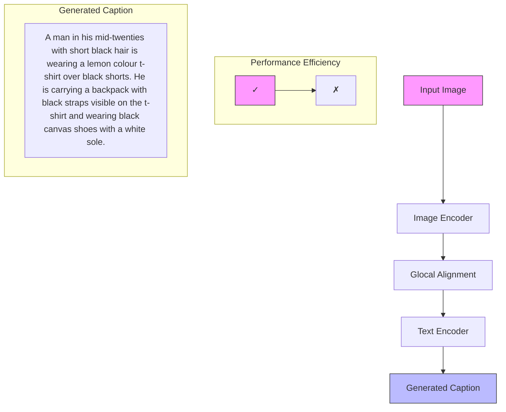
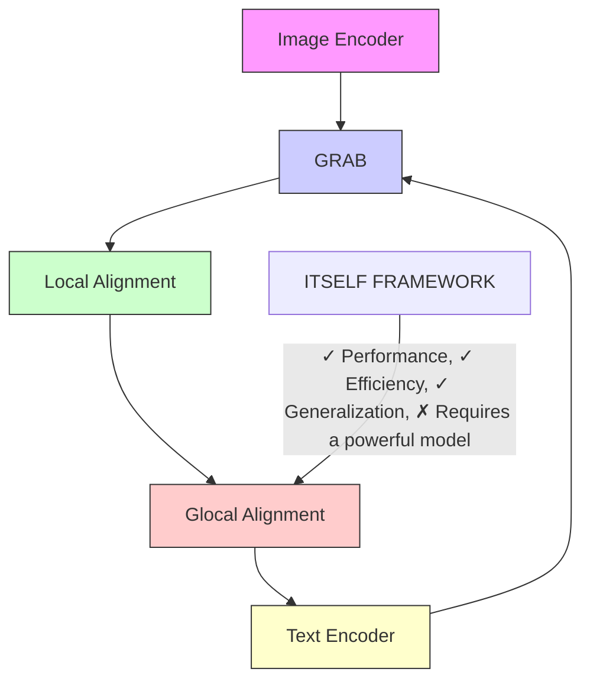
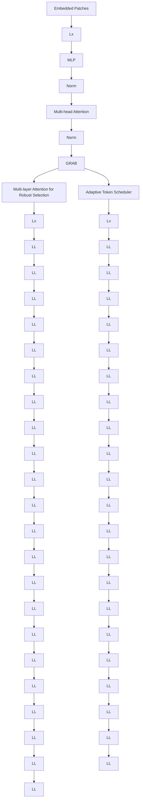

# ITSELF: Attention Guided Fine-Grained Alignment for Vision–Language Retrieval

Tien-Huy Nguyen1,2,∗ Huu-Loc Tran1,2\* Thanh Duc Ngo1,2

1 University of Information Technology, Ho Chi Minh City, VIETNAM 2 Vietnam National University, Ho Chi Minh City, VIETNAM

# Abstract

Vision Language Models (VLMs) have rapidly advanced and show strong promise for text-based person search (TBPS), a task that requires capturing fine-grained relationships between images and text to distinguish individuals. Previous methods address these challenges through local alignment, yet they are often prone to shortcut learning and spurious correlations, yielding misalignment. Moreover, injecting prior knowledge can distort intra-modality structure. Motivated by our finding that encoder attention surfaces spatially precise evidence from the earliest training epochs, and to alleviate these issues, we introduce ITSELF, an attention-guided framework for implicit local alignment. At its core, Guided Representation with Attentive Bank (GRAB) converts the model’s own attention into an Attentive Bank of high-saliency tokens and applies local objectives on this bank, learning fine-grained correspondences without extra supervision. To make the selection reliable and non-redundant, we introduce Multi-Layer Attention for Robust Selection (MARS), which aggregates attention across layers and performs diversity-aware top-k selection; and Adaptive Token Scheduler (ATS), which schedules the retention budget from coarse to fine over training, preserving context early while progressively focusing on discriminative details. Extensive experiments on three widely used TBPS benchmarks show state-of-the-art performance and strong cross-dataset generalization, confirming the effectiveness and robustness of our approach without additional prior supervision. Our project is publicly available at https://trhuuloc.github.io/itself

# 1. Introduction

Text-based person search (TBPS) aims to identify, from a large image gallery, the person best matching a textual query [15]. Solving it requires extracting identitydiscriminative cues from both image and text to distinguish individuals with subtle differences. Recent advances in vision language models (VLMs) [17, 22, 23, 36, 48], notably CLIP [26], have shown strong potential for tackling these fine-grained challenges. Building on this foundation, TBPS-CLIP [3] was the pioneer to apply CLIP to TBPS, followed by extensions [13, 19, 21, 24, 43, 53] that further narrow the text–image gap. However, many recent methods [20, 32, 39, 46, 52, 53] rely on costly external resources. For example, using MLLMs to synthesize auxiliary data (Fig. 1(a)), while effective, increase compute and annotation costs, and hinder scalability and robustness.


<details>
<summary>flowchart</summary>


</details>

(a) Existing Global Matching Approaches   


<details>
<summary>flowchart</summary>

```mermaid
graph TD
    A["Image Encoder"] --> B["Implicit Relation Module"]
    B --> C["Local Alignment"]
    D["Glocal Alignment"] --> B
    E["Text Encoder"] --> B
    style A fill:#f9f,stroke:#333
    style B fill:#ccf,stroke:#333
    style C fill:#cfc,stroke:#333
    style D fill:#fcc,stroke:#333
    style E fill:#cff,stroke:#333
    style_F["Performance ✓"] --> G["Generalization ✗"]
    style G --> H["Local Alignment"]
```
</details>

(b) Existing Local Implicit Matching Approaches


<details>
<summary>flowchart</summary>


</details>

(c) Our Implicit Guided Representation with Attentive Bank (GRAB)   
Figure 1. Evolution of text-based person search paradigms. (a) Global matching method uses powerful MLLM to synthesize extra datasets (b) Recent local implicit matching method implicitly reasons over relations among all local tokens. (c) Ours - ITSELF with GRAB: an attention-guided local branch to learn implicitly fine-grained, discriminative features to achieve better alignment.

To motivate the limitation, we pose a simple question: How can a TBPS model capture fine-grained, discriminative details on its own without costly external supervision? To minimize this, recent work pursues implicit local alignment (Fig. 1(b)) to explore discriminative cues without burdensome external supervision. Embedding-space correspondence methods [9, 34, 38, 45] infer region–phrase matches from implicit signals, yet sparse labels leave these alignments weakly constrained and unstable. Fully implicit feature learning [28, 31, 42] optimizes local losses but overlooks the semantics of specific text–region pairs, offering no guarantee of precise correspondences. Maskedmodeling–style alignment [11, 13] encourages grounding via cross-modal reconstruction, but global-context shortcuts can bypass true dependencies. Across these lines, the core issue persists: locality constraints remain too weak, diffusing supervision, weakening discriminative region selection, and limiting robust local feature learning.

Attention is well suited to surface fine-grained cues and strengthen cross-modal correspondence, yet its potential remains underexplored thoroughly in TBPS. We probe this with a simple diagnostic: attention-guided retention masking (Fig. 2). For each image, we compute attention from the image encoder’s last layer, retain the top-k patches, and mask the rest. We then measure the R1 accuracy gap between the original input and its counterpart over early epochs and multiple retention ratios on RSTP-Reid [51]. This analysis reveals two consistent patterns. First, saliency appears early: by epoch 3, the R1 gap falls below 1 percentage point for every retention setting, indicating that the retained patches already capture nearly all discriminative evidence. Second, attention is spatially precise: selected patches consistently align with semantically meaningful parts and carried objects, providing reliable localization cues for discriminative region–phrase correspondence.

Building on these findings, we present ITSELF, an attention-guided framework for implicit local alignment in TBPS. ITSELF optimizes a global text–image alignment loss and augments it with Guided Representation with Attentive Bank (GRAB), an attention-driven local branch that builds an Attentive Bank by selecting discriminative tokens from both modalities using model’s own attention without additional supervision (Fig. 1(c)). Unlike previous methods that keep local alignment fully implicit, providing no direct constraints on phrase–region correspondence and thus inviting shortcut learning and spurious correlations that cause misalignment, our method injects an attention-derived locality prior that focuses learning on the most informative regions and aligns them consistently across modalities, thereby suppressing noise and reinforcing global alignment. In essence, our key innovation is an attention-driven implicit locality mechanism that turns internal saliency maps into reliable anchors for fine-grained alignment.


<details>
<summary>line</summary>

| Training Epochs | Retention 0.5 | Retention 0.6 | Retention 0.7 |
| --------------- | ------------- | ------------- | ------------- |
| 1               | 4.8           | 3.2           | 2.2           |
| 2               | 3.2           | 2.0           | 0.9           |
| 3               | 1.0           | 0.2           | 0.4           |
</details>

Figure 2. Rank-1 accuracy gap between unmasked and masked images under different mask retention ratios during the early training epochs on RSTP dataset.

Based on analyses [1, 4, 37] showing different attention heads specialize in complementary cues, with distinct patterns emerging at different depths. We introduce Multi-Layer Attention for Robust Selection (MARS) inside GRAB to avoid repeatedly picking the same dominant tokens from a single attention map. MARS aggregates attention across layers and performs diversity-aware top-k selection across modalities, ensuring complementary coverage. The selected tokens populate GRAB’s Attentive Bank, where local objectives reinforce both inter- and intra-modal structure.

As suggested by (Fig. 2) where the R1 gap between unmasked and attention-retained inputs quickly narrows in early epochs, we further introduce an Adaptive Token Scheduler (ATS) that maintains a larger retention budget at the start to avoid discarding important cues and the resulting training instability, then progressively anneals the budget to focus on high-confidence, fine-grained tokens. This schedule reduces redundancy and false negatives and stabilizes local learning. Finally, following recent practice, we adopt CLIP [26] as the backbone, allowing ITSELF to transfer pretrained knowledge while continuing to learn cross-modal, implicit local correspondences on TBPS. In summary, our main contributions are as follows:

• ITSELF Framework: A novel attention-guided implicit local alignment framework, ITSELF, with GRAB leveraging encoder attention to mine fine-grained cues and reinforce global alignment without additional supervision.

• Robust Selection & Scheduling: We propose MARS, which fuses attention across layers and performs diversity-aware top-k selection; and ATS, which anneals the retention budget from coarse to fine over training to stabilize learning and prevent early information loss.

• Strong Empirical Results: Extensive experiments establish SOTA performance on 3 widely used TBPS benchmarks and improved cross-dataset generalization, confirming the effectiveness and robustness of our approach.

# 2. Related Work

# 2.1. Text-based Person Search (TBPS)

Over the last few years, the computer vision community has shown a lot of interest in TBPS [2, 3, 13, 24, 25]. With the rise of Vision-Language Pretraining such as [14, 26], TBPS research increasingly uses large-scale pretraining to achieve stronger cross-modal representations. A recent line of work enhances TBPS performance by incorporating auxiliary signals. For example, some methods utilize human parsing or pose estimation [40, 41] to highlight semantic regions, while others adopt external REID datasets [6, 29, 33, 40, 52, 53] to better adapt to pedestrian domain. These strategies improve fine-grained alignment but introduce additional training cost, annotation dependency, or domain bias. In contrast, our method autonomously extracts and aligns fine-grained local features from both modalities without relying on external datasets or tools, effectively addressing granularity and information gaps in TBPS.

# 2.2. Local Alignment for TBPS

Previous studies enhance fine-grained alignment using either explicit or implicit methods. Explicit approaches leverage external cues, such as human parsing networks [40, 41] or large-scale pretraining [35, 46]. However, their reliance on extensive external supervision, extra annotations and computational resources often limits their generalization. In contrast, implicit methods learn local correspondences directly through network without external data. While this removes the dependency on annotations, these methods often suffer from weak semantic grounding, as the relationship between textual descriptions and specific image regions is not explicitly enforced [13, 31, 44]. Consequently, it remains uncertain whether the learned representations truly capture fine-grained cross-modal details. Our method builds upon implicit, annotation-free work, but introduces a key distinction. Instead of using external models or learning weakly grounded features, we directly exploit the intrinsic attention maps within CLIP. By mining fine-grained cues across multiple layers and selecting the most informative regions, our approach produces more discriminative representations. This lightweight design improves local alignment without requiring additional supervision or pretraining.

# 3. Methodology

This section provides an overview of our proposed framework, ITSELF, in Sec. 3.1. We then detail the core mechanism, GRAB, which incorporates MARS and ATS, in Sec. 3.2. Finally, Sec. 3.3 presents the training strategy and inference process of the overall pipeline.

# 3.1. ITSELF Framework

Our framework consists of three main components Fig. 3: (a) an Image Encoder $f _ { v }$ that encodes images into embeddings, (b) a Text Encoder $f _ { t }$ that generates textual embeddings from captions, and (c) GRAB (Guided Representation with Attentive Bank), which leverages the model’s own attention to construct an attentive bank of high-saliency tokens. Local objectives are then applied on this bank, enabling the model to learn fine-grained correspondences without requiring additional supervision. Following prior works [13, 24, 25], we adopt CLIP ViT-B/16 as the backbone for both the visual and textual modalities.

Image Encoder: Given an input image $I _ { i } ~ \in ~ V$ , we divide it into $N ~ = ~ H \times W / \bar { P ^ { 2 } }$ non-overlapping patches of size P , flatten and project them into a D-dimensional space, and prepend a learnable [CLS] token with positional embeddings. The sequence is fed into a transformer encoder, yielding visual embeddings $\begin{array} { r } { \mathcal { V } _ { i } = f _ { v } ( I _ { i } ) = } \end{array}$ $\{ v _ { \mathrm { g l o b a l } } ^ { i } , v _ { l o c a l } ^ { i } \} \stackrel { \bullet } { \in } \mathbb { R } ^ { ( 1 + \mathbf { \bar { \cal N } } ) \times D }$ , where $v _ { g l o b a l } ^ { i } = v _ { \mathrm { c l s } } ^ { i }$ is the global embedding and $v _ { l o c a l } ^ { i } = \{ v _ { j } ^ { i } \} _ { j = 1 } ^ { N }$ are patch embeddings.

Text Encoder: For text, we adopt CLIP’s Transformerbased encoder. Given a caption $T _ { i } ~ \in ~ T .$ , it is tokenized with BPE and wrapped with [SOS]/[EOS] tokens. The sequence is embedded and passed through the transformer to produce $\mathcal { T } _ { i } = f _ { t } ( T _ { i } ) = \dot { \{ t _ { \mathrm { g l o b a l } } ^ { i } , t _ { \mathrm { l o c a l } } ^ { i } \} } ^ { = } \in \mathbb { R } ^ { ( L + 2 ) \times D }$ , where tigloba $t _ { \mathrm { g l o b a l } } ^ { i } ~ = ~ t _ { e } ^ { i }$ (from [EOS]) is the global embedding, and $t _ { \mathrm { l o c a l } } ^ { i } = \{ t _ { j } ^ { i } \} _ { j = 1 } ^ { L }$ are token-level embeddings. The [SOS] token $t _ { s } ^ { i }$ is retained but unused.

# 3.2. Guided Representation with Attentive Bank

# 3.2.1. Multi-layer Attention for Robust Selection

To learn robust implicit local representations, we design the GRAB, which retains a diverse set of highly discriminative tokens. Building on our finding Fig. 2 that tokens with consistently high attention values encode core identity cues, even from the earliest training epochs. However, selecting tokens based solely on a single fixed layer is inherently suboptimal, since different Transformer layers capture different types of information: shallow layers emphasize low-level textures, middle layers capture broader context, and deeper layers encode semantic abstractions that may suppress fine-grained details. To overcome this limitation, we introduce Multi-layer Attention for Robust Selection (MARS), which aggregates attention information across multiple layers to provide a more stable and reliable estimate of patch importance. Formally, given attention maps $\mathbf { A } ^ { ( \ell ) } ~ \in ~ \mathbb { R } ^ { N \times \mathbf { \bar { N } } }$ from selected layers $\ell \in \mathcal { L } .$ , we denoise by removing the lowest $\delta _ { \ell }$ fraction of attention weights, thereby filtering out non-informative links. The pruned attention map is then combined with the identity matrix I to preserve self-dependencies and normalized as:


<details>
<summary>flowchart</summary>


</details>

Figure 3. Overview of our proposed ITSELF (an attention-guided implicit local alignment framework). The architecture features a dualstream encoder for images (left) and text (right). At its core is the GRAB (Guided Representation with Attentive Bank) module, which is designed to learn fine-grained, discriminative cues. GRAB is composed of two key components: MARS (Multi-layer Attention for Robust Selection), which fuses attention across layers to select informative patches/tokens, and ATS (Adaptive Token Scheduler), which anneals the token selection from coarse to fine during training. The model is optimized with a dual-loss strategy: a local loss $L _ { l o c a l }$ aligns the guided local representations, and a global loss $L _ { g l o b a l }$ matches the final overall embeddings. This allows ITSELF to reinforce global text-image alignment without requiring additional supervision or adding any inference-time cost.

$$
\hat {\mathbf {A}} ^ {(\ell)} = \text { Norm } \left(\frac {\text { Discard } \left(\mathbf {A} ^ {(\ell)} , \delta_ {\ell}\right) + \mathbf {I}}{2}\right), \tag {1}
$$

where, \protect \operatorname {Discard}(\cdot , \delta \_\ell ) $( \cdot , \delta _ { \ell } )$ sets the lowest $\delta _ { \ell }$ proportion of elements to zero while preserving the rest.

The aggregated attention across the selected layers is then computed by sequential composition:

$$
\mathbf {R} = \prod_ {\ell \in \mathcal {L}} \hat {\mathbf {A}} _ {b} ^ {(\ell)}, \quad \mathbf {R} \in \mathbb {R} ^ {N \times N}. \tag {2}
$$

Based on the aggregated map R, we obtain local features $\mathbf { f } _ { i } ^ { \mathrm { l o c } } , \mathbf { f } _ { t } ^ { \mathrm { l o c } }$ by selecting the most informative tokens:

$$
\mathbf {f} _ {i} ^ {\mathrm{loc}}, \mathbf {f} _ {t} ^ {\mathrm{loc}} = \mathrm{TopK} \left(\mathbf {R} _ {i}, \mathbf {R} _ {t}, v _ {l o c a l} ^ {i}, t _ {l o c a l} ^ {i}\right), (3)
$$

where $\mathbf { R } _ { i }$ and $\mathbf { R } _ { t }$ denote the aggregated attention maps for image and text modalities.

By ranking and selecting the diversity-aware top-k tokens according to R, MARS implicitly captures finegrained feature, amplify discriminative signals, suppress background noise, strengthens the global embedding and yields a more robust, identity-aware feature space.

# 3.2.2. Adaptive Token Scheduler

To further strengthen local feature learning, we introduce the Adaptive Token Scheduler (ATS). Unlike a fixed token budget, which may retain excessive background information or prematurely discard useful details, ATS anneals the

Algorithm 1 GRAB: Implicit Local Alignment   
Require: Patch/Token features $v_{local}^{i}, v_{local}^{t}$ ; attention maps $\{\mathbf{A}^{(\ell)}\}$ ; Adapter( $\cdot$ ), GPO( $\cdot$ ); loss $\mathcal{L}_{\mathrm{local}}(\cdot, \cdot)$   
Ensure: Local-alignment loss \protect \mathcal {L}

1: Aggregated attention (MARS): $\mathbf { R } _ { i } , \mathbf { R } _ { t }$ calculated by Eq. (2).   
2: Token budget (ATS): $k $ calculated by Eq. (4).   
3: Select informative tokens: $( \mathbf { f } _ { i } ^ { \mathrm { l o c } } , \mathbf { f } _ { t } ^ { \mathrm { l o c } } )$ calculated by Eq. (3) using $\mathbf { R } _ { i } , \mathbf { R } _ { t }$ and k.   
4: Local adaptation (residual): $( \mathbf { f } _ { i } ^ { \mathrm { l o c } } , \mathbf { f } _ { t } ^ { \mathrm { l o c } } ) \gets$ Adapter $( \mathbf { f } _ { i } ^ { \mathrm { l o c } } , \mathbf { f } _ { t } ^ { \mathrm { l o c } } ) + ( \mathbf { f } _ { . } ^ { l o c } , \mathbf { f } _ { t } ^ { l o c } )$ .   
5: Pooling: $\mathbf { v }  \mathrm { G P O } ( \mathbf { f } _ { i } ^ { \mathrm { l o c } } )$ , $\tau \gets \mathrm { G P O } ( \mathbf { f } _ { t } ^ { \mathrm { l o c } } )$   
6: Loss: $\mathcal { L } \gets \mathcal { L } _ { \mathrm { l o c a l } } ( \mathbf { v } , \tau )$   
7: return $\mathcal { L } .$

number of selected tokens over training, This design follows a coarse-to-fine paradigm: in early stages, a larger proportion of tokens is preserved to avoid losing critical identity cues; in later stages, the selection increasingly focuses on highly discriminative patches. Formally, the number of retained tokens at step t is defined as:

$$
k _ {t} = \left\{ \begin{array}{l l} \left\lfloor N \rho_ {\text { start }} \left(\frac {\rho_ {\text { end }}}{\rho_ {\text { start }}}\right) ^ {\frac {t}{T}} \right\rfloor , & \text { if   } t \leq T, \\ \left\lfloor N \rho_ {\text { end }} \right\rfloor , & \text { if   } t > T, \end{array} \right. \tag {4}
$$

where N is the number of tokens, $\rho _ { \mathrm { s t a r t } }$ and $\rho _ { \mathrm { e n d } }$ are the initial and final retention ratios, t is the current training step, and T is the schedule length. This gradual narrowing mitigates early information loss and stabilizes training, while ultimately emphasizing fine-grained signals that complement the global embedding.

# 3.2.3. Implicit Local Learning Alignment

Algorithm description. To populate the Attentive Bank with the most discriminative cues from both modalities, we score each patch/token by the aggregated attention R returned by MARS. In early training, to stabilize optimization and avoid missing salient regions, we use ATS to schedule a decaying token budget k decreasing over steps. At each step, we select the top-k patches/tokens with the highest attention in R and insert them into the bank. To bridge modality shift and refine local features while preserving the original signal, the selected tokens are passed through a lightweight Adapter (MLP) with a residual connection. We then apply GPO [5] to obtain Guided Local Embedding $\mathbf { v } , \tau$ and compute the local-alignment loss $\mathcal { L } _ { \mathrm { l o c a l } }$ . The complete procedure is summarized in Algorithm 1.

# 3.3. Training and Inference

Training. To optimize both global appearance and finegrained discriminative tokens, our approach combines Triplet Alignment Loss (TAL) [25] and Cross-Modal Identity Loss (CID) [53]. By applying these specialized losses to separate global and local embeddings, the model learns a more comprehensive and robust representation for matching textual descriptions to pedestrian images.

Given an image-text pair (I, T ), the loss is defined as:

$$
\mathcal {L} = \mathcal {L} _ {t a l} + \mathcal {L} _ {c i d} \tag {5}
$$

We apply this loss to the global embedding $( v _ { g l o b a l } , t _ { g l o b a l } )$ and the guided local representation $( \mathbf { v } , \tau )$ , yielding

$$
\mathcal {L} _ {\text { global }} = \mathcal {L} (v _ {\text { global }}, t _ {\text { global }}), \mathcal {L} _ {\text { local }} = \mathcal {L} (\mathbf {v}, \tau) \tag {6}
$$

The overall training objective is the sum of the two:

$$
\mathcal {L} _ {\text { total }} = \mathcal {L} _ {\text { global }} + \mathcal {L} _ {\text { local }} \tag {7}
$$

Inference. In the inference process, the final image-text pair similarity is computed by combining both global and local similarity. Here is the specific computation formula:

$$
\mathcal {S} = \lambda_ {S} \times \mathcal {S} _ {\text { global }} + (1 - \lambda_ {S}) \times \mathcal {S} _ {\text { local }} \tag {8}
$$

where $\mathcal { S } _ { g l o b a l }$ and $\boldsymbol { S _ { l o c a l } }$ represent global similarity and local similarity, respectively, and $\lambda _ { S }$ is the weighting factor.

# 4. Experiment

# 4.1. Experimental Setup

Datasets. We evaluate the effectiveness of the proposed method on widely used public datasets for TBPR tasks, including CUHK-PEDES [15], ICFG-PEDES [7], and RST-PReid [50]. Additional details about these datasets are provided in the Supplementary Material.

Evaluation Metrics. For evaluation, we employ the widely used Rank-k accuracy (k = 1, 5, 10) and mean Average Precision (mAP) metrics across all three datasets.

# 4.2. Quantitative Results

Comparison with state-of-the-art methods. We present comparison results with SOTA methods on three widely used benchmark datasets Tab. 1. Our approach clearly stands out, outperforming all CLIP-based competitors on every metric. Within CLIP-backbone methods, we set new SOTA R@1 on all datasets, improving over the strongest prior by +1.01%, +1.55%, and +1.95%, and we also obtain the best mAP on every benchmark, with the largest gain on RSTP-Reid (+2.17% mAP). These gains persist at deeper ranks, R@5/R@10 are best or tied-best, indicating broad retrieval improvements rather than a single-metric bump.

<table><tr><td rowspan="2">Method</td><td rowspan="2">Venue</td><td rowspan="2">Image enc.</td><td rowspan="2">Text enc.</td><td colspan="4">CUHK-PEDES</td><td colspan="4">ICFG-PEDES</td><td colspan="4">RSTP-Reid</td></tr><tr><td>R@1</td><td>R@5</td><td>R@10</td><td>mAP</td><td>R@1</td><td>R@5</td><td>R@10</td><td>mAP</td><td>R@1</td><td>R@5</td><td>R@10</td><td>mAP</td></tr><tr><td colspan="16">with ALBEF backbone:</td></tr><tr><td>RaSa [2]</td><td>IJCAI&#x27;23</td><td>Swin-B</td><td>BERT</td><td>76.51</td><td>90.29</td><td>94.25</td><td>69.38</td><td>65.28</td><td>80.40</td><td>85.12</td><td>41.29</td><td>65.20</td><td>84.05</td><td>89.85</td><td>50.14</td></tr><tr><td>MARS [8]</td><td>TOMM&#x27;25</td><td>Swin-B</td><td>BERT</td><td>77.62</td><td>90.63</td><td>94.27</td><td>71.71</td><td>67.60</td><td>81.47</td><td>85.79</td><td>44.93</td><td>67.55</td><td>86.65</td><td>91.35</td><td>52.92</td></tr><tr><td colspan="16">with using external tools or ReID-Domain Pre-training:</td></tr><tr><td>UniPT [30]</td><td>ICCV&#x27;23</td><td>ViT-B/16</td><td>BERT</td><td>68.50</td><td>84.67</td><td>90.38</td><td>-</td><td>60.09</td><td>76.19</td><td>82.46</td><td>-</td><td>51.85</td><td>74.85</td><td>82.85</td><td>-</td></tr><tr><td>CFAM (B/16) [53]</td><td>CVPR&#x27;24</td><td>CLIP-ViT</td><td>CLIP-Xformer</td><td>72.87</td><td>88.61</td><td>92.87</td><td>64.92</td><td>62.17</td><td>79.57</td><td>85.32</td><td>36.34</td><td>59.40</td><td>81.35</td><td>88.50</td><td>46.04</td></tr><tr><td>SAP-SAM [40]</td><td>MM&#x27;24</td><td>CLIP-ViT</td><td>CLIP-Xformer</td><td>75.05</td><td>89.93</td><td>93.73</td><td>-</td><td>63.97</td><td>80.84</td><td>86.17</td><td>-</td><td>62.85</td><td>82.65</td><td>89.85</td><td>-</td></tr><tr><td>CFAM(L/14) [53]</td><td>CVPR&#x27;24</td><td>CLIP-ViT</td><td>CLIP-Xformer</td><td>75.60</td><td>90.53</td><td>94.36</td><td>67.27</td><td>65.38</td><td>81.17</td><td>86.35</td><td>39.42</td><td>62.45</td><td>83.55</td><td>91.10</td><td>49.50</td></tr><tr><td>DP [33]</td><td>AAAI&#x27;24</td><td>CLIP-ViT</td><td>CLIP-Xformer</td><td>75.66</td><td>90.59</td><td>94.07</td><td>66.58</td><td>65.61</td><td>81.73</td><td>86.95</td><td>39.14</td><td>62.48</td><td>83.77</td><td>89.93</td><td>48.86</td></tr><tr><td>APTM [46]</td><td>MM&#x27;23</td><td>Swin-B</td><td>BERT</td><td>76.53</td><td>90.04</td><td>94.15</td><td>66.91</td><td>68.51</td><td>82.99</td><td>87.56</td><td>41.22</td><td>67.50</td><td>85.70</td><td>91.45</td><td>52.56</td></tr><tr><td>AUL [16]</td><td>AAAI&#x27;24</td><td>Swin-B</td><td>BERT</td><td>77.23</td><td>90.43</td><td>94.41</td><td>-</td><td>69.16</td><td>83.32</td><td>88.37</td><td>-</td><td>71.65</td><td>87.55</td><td>92.05</td><td>-</td></tr><tr><td>CAMeL [47]</td><td>TIFS&#x27;25</td><td>SG-Former</td><td>BERT</td><td>77.24</td><td>91.80</td><td>95.16</td><td>68.32</td><td>68.70</td><td>83.11</td><td>88.32</td><td>41.58</td><td>68.50</td><td>87.40</td><td>92.70</td><td>53.61</td></tr><tr><td colspan="16">with CLIP backbone:</td></tr><tr><td>CLIP (ViT-B/16) [26]</td><td>ICML&#x27;21</td><td>CLIP-ViT</td><td>CLIP-Xformer</td><td>65.73</td><td>86.39</td><td>92.01</td><td>61.97</td><td>56.23</td><td>74.29</td><td>81.62</td><td>30.85</td><td>56.67</td><td>78.09</td><td>86.62</td><td>42.85</td></tr><tr><td>CFine [44]</td><td>TIP&#x27;23</td><td>CLIP-ViT</td><td>BERT</td><td>69.57</td><td>85.93</td><td>91.15</td><td>-</td><td>60.83</td><td>76.55</td><td>82.42</td><td>-</td><td>50.55</td><td>72.50</td><td>81.60</td><td>-</td></tr><tr><td>CSKT [18]</td><td>ICASSP&#x27;24</td><td>CLIP-ViT</td><td>CLIP-Xformer</td><td>69.70</td><td>86.92</td><td>91.80</td><td>62.74</td><td>58.90</td><td>77.31</td><td>83.56</td><td>33.87</td><td>57.75</td><td>81.30</td><td>88.35</td><td>46.43</td></tr><tr><td>DM-Adapter [19]</td><td>AAAI&#x27;25</td><td>CLIP-ViT</td><td>CLIP-Xformer</td><td>72.17</td><td>88.74</td><td>92.85</td><td>64.33</td><td>62.64</td><td>79.53</td><td>85.32</td><td>36.50</td><td>60.00</td><td>82.10</td><td>87.90</td><td>47.37</td></tr><tr><td>IRRA [13]</td><td>CVPR&#x27;23</td><td>CLIP-ViT</td><td>CLIP-Xformer</td><td>73.38</td><td>89.93</td><td>93.71</td><td>66.13</td><td>63.46</td><td>80.25</td><td>85.82</td><td>38.06</td><td>60.20</td><td>81.30</td><td>88.20</td><td>47.17</td></tr><tr><td>TBPSCLIP [3]</td><td>AAAI&#x27;24</td><td>CLIP-ViT</td><td>CLIP-Xformer</td><td>73.54</td><td>88.19</td><td>92.35</td><td>65.38</td><td>65.05</td><td>80.34</td><td>85.47</td><td>39.83</td><td>61.95</td><td>83.55</td><td>88.75</td><td>48.26</td></tr><tr><td>BiLMa [10]</td><td>ICCV&#x27;23</td><td>CLIP-ViT</td><td>CLIP-Xformer</td><td>74.03</td><td>89.59</td><td>93.62</td><td>66.57</td><td>63.83</td><td>80.15</td><td>85.74</td><td>38.26</td><td>61.20</td><td>81.50</td><td>88.80</td><td>48.51</td></tr><tr><td>MUM [49]</td><td>AAAI&#x27;24</td><td>CLIP-ViT</td><td>CLIP-Xformer</td><td>74.25</td><td>89.83</td><td>93.58</td><td>66.15</td><td>65.62</td><td>80.54</td><td>85.83</td><td>38.78</td><td>63.40</td><td>83.30</td><td>90.30</td><td>49.28</td></tr><tr><td>CRUE [12]</td><td>TOMM&#x27;25</td><td>CLIP-ViT</td><td>CLIP-Xformer</td><td>74.91</td><td>90.11</td><td>93.90</td><td>68.93</td><td>64.88</td><td>80.90</td><td>86.36</td><td>41.82</td><td>63.15</td><td>82.80</td><td>90.20</td><td>50.20</td></tr><tr><td>PLOT [24]</td><td>ECCV&#x27;24</td><td>CLIP-ViT</td><td>CLIP-Xformer</td><td>75.28</td><td>90.42</td><td>94.12</td><td>-</td><td>65.76</td><td>81.39</td><td>86.73</td><td>-</td><td>61.80</td><td>82.85</td><td>89.45</td><td>-</td></tr><tr><td>RDE [25]</td><td>CVPR&#x27;24</td><td>CLIP-ViT</td><td>CLIP-Xformer</td><td>75.94</td><td>90.14</td><td>94.12</td><td>67.56</td><td>67.68</td><td>82.47</td><td>87.36</td><td>40.06</td><td>65.35</td><td>83.95</td><td>89.90</td><td>50.88</td></tr><tr><td>Ours</td><td>WACV&#x27;26</td><td>CLIP-ViT</td><td>CLIP-Xformer</td><td>76.95</td><td>90.64</td><td>94.36</td><td>69.38</td><td>69.23</td><td>82.84</td><td>87.62</td><td>43.80</td><td>67.30</td><td>85.60</td><td>90.50</td><td>53.05</td></tr></table>

Table 1. Performance of text-based person search methods on three datasets.

Crucially, we achieve this without ReID-domain pretraining by mining multi-layer attention (MARS) to guide implicit local alignment. Despite this minimalist setup, we still surpass methods that leverage extra resources or larger backbones (e.g., CFAM(L/14), DP, UniPT). Notably, using only CLIP, we attain the top R@1 on ICFG-PEDES over all methods.

Domain Generalization. We further evaluate the crossdomain robustness of our model by training on one source dataset and directly testing on another unseen target dataset without fine-tuning. Using CUHK-PEDES (C), ICFG-PEDES (I), and RSTPReid (R), we form six transfer settings (e.g., C→I, I→R). Existing local implicit matching methods such as IRRA often achieve strong in-domain performance but generalize poorly, mainly because their relational modules overfit to dataset-specific patterns such as clothing styles or annotation bias. As a result, their learned correspondences fail to transfer effectively across domains. In contrast, our method avoids such overfitting by integrating attentive bank guidance with balanced local–global alignment, enabling more semantically stable representations. As shown in Tab. 2, our approach achieves the best results in all six transfer settings. For instance, in the C→I scenario, we obtain 50.58% R@1 and 27.32% mAP, surpassing RDE by 2.40% and 2.32%. Similarly, in the challenging I→R transfer, we improve the previous best R@1 by over 2%. These results demonstrate that unlike prior local implicit methods, our model achieves both high performance and strong domain generalization—crucial for real-world TBPS scenarios with diverse and shifting data distributions.

# 4.3. Qualitative Results

Top-5 Retrieval Examples. Fig. 4 qualitatively demonstrates our method’s superiority over RDE on the RSTPReid benchmark. For a query about a man in a black jacket and blue down jacket, our method retrieves all five correct matches, whereas RDE finds only three. With a query for a man in an orange coat with a hand-in-pocket pose, our approach correctly retrieves three images in the top ranks, while RDE secures only two, ranking the second true positive fourth. For a boy in a black jacket with white patterns, our method again excels with three correct top-ranked retrievals, contrasting with RDE’s single correct match at R3. These examples highlight our framework’s enhanced ability to align fine-grained textual descriptions with relevant visual details.

Attention Comparison. Fig. 5 presents Grad-CAM [27] visualizations comparing RDE [25] and our method. Our approach achieves sharper localization by focusing on query-specific elements (e.g., clothing and accessories) with minimal spillover, effectively isolating the target pedestrian in multi-person scenes. In contrast, RDE produces diffuse, often irrelevant hotspots, leading to fragmented text-image associations. These results highlight our framework’s stronger attribute-level fidelity and reduced cross-identity confusion, crucial for real-world person search.

<table><tr><td></td><td>Method</td><td>R1</td><td>R5</td><td>R10</td><td>mAP</td></tr><tr><td rowspan="4">C→I</td><td>IRRA [13]</td><td>42.41</td><td>62.11</td><td>69.62</td><td>21.77</td></tr><tr><td>CLIP [26]</td><td>43.04</td><td>-</td><td>-</td><td>22.45</td></tr><tr><td>RDE [25]</td><td>48.18</td><td>66.30</td><td>73.70</td><td>25.00</td></tr><tr><td>Ours</td><td>50.58</td><td>67.81</td><td>74.68</td><td>27.32</td></tr><tr><td rowspan="4">I→C</td><td>IRRA [13]</td><td>33.48</td><td>56.29</td><td>66.33</td><td>31.56</td></tr><tr><td>CLIP [26]</td><td>33.90</td><td>-</td><td>-</td><td>31.65</td></tr><tr><td>RDE [25]</td><td>38.11</td><td>59.24</td><td>68.44</td><td>34.16</td></tr><tr><td>Ours</td><td>41.05</td><td>63.30</td><td>72.08</td><td>37.79</td></tr><tr><td rowspan="4">I→R</td><td>IRRA [13]</td><td>45.30</td><td>69.25</td><td>78.80</td><td>36.82</td></tr><tr><td>CLIP [26]</td><td>47.45</td><td>-</td><td>-</td><td>36.83</td></tr><tr><td>RDE [25]</td><td>49.25</td><td>72.10</td><td>80.20</td><td>38.46</td></tr><tr><td>Ours</td><td>51.30</td><td>73.30</td><td>80.40</td><td>41.07</td></tr><tr><td rowspan="4">R→I</td><td>IRRA [13]</td><td>32.30</td><td>49.67</td><td>57.80</td><td>20.54</td></tr><tr><td>CLIP [26]</td><td>33.58</td><td>-</td><td>-</td><td>19.58</td></tr><tr><td>RDE [25]</td><td>42.17</td><td>58.32</td><td>65.49</td><td>26.37</td></tr><tr><td>Ours</td><td>43.32</td><td>59.17</td><td>66.16</td><td>27.57</td></tr><tr><td rowspan="4">C→R</td><td>CLIP [26]</td><td>52.55</td><td>-</td><td>-</td><td>39.97</td></tr><tr><td>IRRA [13]</td><td>53.25</td><td>77.15</td><td>85.35</td><td>39.63</td></tr><tr><td>RDE [25]</td><td>54.90</td><td>77.50</td><td>86.50</td><td>41.27</td></tr><tr><td>Ours</td><td>58.05</td><td>79.30</td><td>86.85</td><td>43.72</td></tr><tr><td rowspan="4">R→C</td><td>IRRA [13]</td><td>32.80</td><td>55.26</td><td>65.81</td><td>30.29</td></tr><tr><td>CLIP [26]</td><td>35.25</td><td>-</td><td>-</td><td>32.35</td></tr><tr><td>RDE [25]</td><td>36.94</td><td>58.22</td><td>67.58</td><td>33.65</td></tr><tr><td>Ours</td><td>40.32</td><td>61.70</td><td>71.04</td><td>36.65</td></tr></table>

Table 2. Comparisons with state-of-the-arts(domain generalization). Here “C” denotes CUHK-PEDES, “I” represents ICFG-PEDES and ”R” means RSTPReid.


<details>
<summary>text_image</summary>

Query
This man wears a black jacket, navy blue pants and brown shoes. A bright blue down jacket inside and he wears the jacket's hat.
The man was wearing an orange coat, black trousers and brown shoes. He is wearing glasses. He walks with his hand in his pocket.
The boy wearing a black jacket with some white pattern on it, jeans and a pair of grey and white sneakers. He is carrying a backpack as well.
Ours
RDE
R1 → R5
R1 → R5
</details>

Figure 4. Qualitative results of text-to-image retrieval on RST-PReid benchmark, comparing our method with RDE [25]. Retrieved images are ranked from left to right in descending order of similarity. Correct matches are outlined in green, while incorrect ones are shown in red. Text highlighted in green indicates the descriptive details effectively captured by our approach.


<details>
<summary>text_image</summary>

Query
A man in his mid-thirties with short black hair is wearing a brown bomber jacket over grey formal pants. He is carrying a backpack with red straps visible on the jacket.
GT	RDE	Ours
A woman in her thirties with shoulder-length black hair is wearing a blue puffer jacket. She is also wearing a pair of black pants and blue Nike sneakers. She is holding a black suitcase.
</details>

Figure 5. Qualitative comparison of attention maps generated by RDE [25] and by our method using the Grad-CAM.[27]

Analysis on Top-K token Selection. The comparison in Fig. 12 shows our proposed top-K token selection is more effective than the baseline. While the baseline produces a scattered attention map misaligned with the query, our method generates a focused, semantically relevant map. It successfully pinpoints image regions corresponding to keywords demonstrating a superior ability to ground textual descriptions in their correct visual context for accurate retrieval.


<details>
<summary>text_image</summary>

Query
The man was wearing a grey coat, blue trousers and brown shoes. He walks with his hand in his pocket and carries a gray backpack.
The woman was wearing a white coat, black trousers and red boots. She is wearing glasses. She walked with a black backpack on her back and her hand in her pocket.
GT
Baseline
Ours
</details>

Figure 6. Comparison of selected top-K patches in text-to-image retrieval by the baseline and by our method. Our approach highlights more semantically relevant regions (e.g., clothing colors and accessories) corresponding to the query descriptions.

# 4.4. Ablation Study

Effectiveness of each component: To comprehensively evaluate the contribution of each component in our proposed ITSELF framework, we conduct a systematic empirical analysis on three publicly available datasets. The detailed experimental results are presented in Tab. 3. MARS module: To evaluate the effectiveness of MARS, we first compare it with a fixed single-layer strategy (SL). Following our entropy of attention distributions (Fig. 7 (Left)), we select layer 3 as SL since it exhibits the lowest entropy, indicating higher confidence. While both SL and MARS outperform the baseline, MARS consistently achieves superior results across all datasets, with notable R1 gains of +2.24%, +3.01%, and +5.65%, demonstrating its clear advantage over relying on a fixed SL. ATS Module: Adding ATS on top of the SL-only baseline already yields consistent gains in R1. When combined with MARS in the full model, we achieve the strongest performance overall, with substantial improvements over the baseline (+2.29%, +3.17%, +6.00%) on three datasets. These results confirm that ATS not only prevents the loss of discriminative cues in early training but also contributes to more stable optimization.

<table><tr><td rowspan="2">Method</td><td colspan="3">GRAB</td><td colspan="4">CUHK-PEDES</td><td colspan="4">ICFG-PEDES</td><td colspan="4">RSTPReid</td></tr><tr><td>SL</td><td>MARS</td><td>ATS</td><td>R@1</td><td>R@5</td><td>R@10</td><td>mAP</td><td>R@1</td><td>R@5</td><td>R@10</td><td>mAP</td><td>R@1</td><td>R@5</td><td>R@10</td><td>mAP</td></tr><tr><td>Baseline</td><td>✕</td><td>✕</td><td>✕</td><td>74.66</td><td>89.70</td><td>93.57</td><td>67.63</td><td>66.06</td><td>81.12</td><td>86.10</td><td>41.02</td><td>61.30</td><td>80.85</td><td>87.65</td><td>49.12</td></tr><tr><td>+SL</td><td>√</td><td>✕</td><td>✕</td><td>76.49</td><td>90.20</td><td>94.35</td><td>58.97</td><td>67.93</td><td>82.36</td><td>87.12</td><td>42.38</td><td>65.00</td><td>85.45</td><td>90.15</td><td>52.26</td></tr><tr><td>+MARS</td><td>✕</td><td>√</td><td>✕</td><td>76.90</td><td>90.46</td><td>94.35</td><td>69.71</td><td>69.07</td><td>82.72</td><td>87.51</td><td>43.67</td><td>66.95</td><td>85.15</td><td>90.40</td><td>53.05</td></tr><tr><td>+SL+ATS</td><td>√</td><td>✕</td><td>√</td><td>76.66</td><td>90.58</td><td>94.22</td><td>69.18</td><td>68.76</td><td>82.74</td><td>87.45</td><td>43.35</td><td>65.95</td><td>85.60</td><td>90.10</td><td>52.71</td></tr><tr><td>Ours</td><td>✕</td><td>√</td><td>√</td><td>76.95</td><td>90.64</td><td>94.36</td><td>69.38</td><td>69.23</td><td>82.84</td><td>87.62</td><td>43.80</td><td>67.30</td><td>85.60</td><td>90.50</td><td>53.05</td></tr><tr><td>Δ</td><td>-</td><td>-</td><td>-</td><td>+2.29</td><td>+0.94</td><td>+0.79</td><td>+1.75</td><td>+3.17</td><td>+1.72</td><td>+1.52</td><td>+2.78</td><td>+6.00</td><td>+4.75</td><td>+2.85</td><td>+3.93</td></tr></table>

Table 3. Ablation study on each component of ITSELF on three datasets.


<details>
<summary>line</summary>

| Layer Index | Epoch 10 | Epoch 20 | Epoch 30 | Epoch 40 | Epoch 50 | Epoch 60 |
| ----------- | -------- | -------- | -------- | -------- | -------- | -------- |
| 1           | 3.3      | 3.3      | 3.3      | 3.3      | 3.3      | 3.3      |
| 2           | 2.3      | 2.3      | 2.3      | 2.3      | 2.3      | 2.3      |
| 3           | 2.2      | 2.2      | 2.2      | 2.2      | 2.2      | 2.2      |
| 4           | 3.1      | 3.1      | 3.1      | 3.1      | 3.1      | 3.1      |
| 5           | 4.0      | 4.0      | 4.0      | 4.0      | 4.0      | 4.0      |
| 6           | 4.2      | 4.2      | 4.2      | 4.2      | 4.2      | 4.2      |
| 7           | 4.0      | 4.0      | 4.0      | 4.0      | 4.0      | 4.0      |
| 8           | 3.7      | 3.7      | 3.7      | 3.7      | 3.7      | 3.7      |
| 9           | 3.5      | 3.5      | 3.5      | 3.5      | 3.5      | 3.5      |
| 10          | 3.2      | 3.2      | 3.2      | 3.2      | 3.2      | 3.2      |
| 11          | 3.5      | 3.5      | 3.5      | 3.5      | 3.5      | 3.5      |
| 12          | 3.6      | 3.6      | 3.6      | 3.6      | 3.6      | 3.6      |
</details>


<details>
<summary>line</summary>

| Settings   | R1    | mAP   |
| ---------- | ----- | ----- |
| Baseline   | 65.00 | 52.26 |
| E+M        | 66.15 | 51.85 |
| M+L        | 66.95 | 53.05 |
| E+L        | 65.70 | 52.08 |
| E+M+L      | 65.95 | 52.71 |
</details>


<details>
<summary>line</summary>

| Discard Ratio | R1    | mAP   |
| ------------- | ----- | ----- |
| 0.10          | 66.20 | 52.55 |
| 0.15          | 66.35 | 51.78 |
| 0.20          | 66.55 | 52.83 |
| 0.25          | 66.95 | 53.05 |
| 0.30          | 66.20 | 52.65 |
| 0.35          | 65.65 | 52.48 |
| 0.40          | 66.55 | 52.53 |
| 0.45          | 66.30 | 51.94 |
</details>

Figure 7. (Left) Entropy of attention per CLIP layer across training epochs. (Middle) Ablation of which CLIP layers are selected for MARS (E: Early, M: Middle, L: Late). (Right) Sensitivity of the MARS discard ratio, evaluated on R1 and mAP.

Analysis of Layer Selection and Discard Ratio in MARS: From the middle plot in Fig. 7, multi-layer configurations in MARS consistently outperform the baseline, with the Middle+Late (M+L) combination achieving the best R1 and mAP among all layer-type combinations (E, M, L and their pairings). The left plot explains why: early layer’s attention (notably layer 3) have the lowest entropy, meaning attention is sharply peaked on a few low-level tokens (edges/textures or background), which offers weak semantic grounding and can inject noise when fused. By contrast, middle layers show the higher entropy, capturing broader context and relations, while late layers re-focus attention onto salient, semantic regions. Fusing ”M+L” therefore balances contextual coverage with discriminative focus, outperforming any option that includes Early Layer’s Attention. Finally, the right plot shows the best performance at a discard ratio of 0.25, indicating that removing a small fraction of low-attention tokens during fusion filters noise and sharpens discriminative cues.

# 5. Conclusion

In this paper, we introduce ITSELF, a novel attentionguided framework for implicit local alignment in TBPS that turns CLIP’s multi-layer attention into an Attentive Bank without extra supervision or inference-time cost. Building on this idea, GRAB harvests and optimizes fine-grained correspondences through an implicit local objective that complements the global loss. To realize GRAB, MARS adaptively aggregates and ranks attention across layers to select the most discriminative patches/tokens. In parallel, ATS schedules the token-retention budget from coarse to fine, mitigating early information loss and stabilizing training. Extensive experiments on three widely used TBPS benchmarks demonstrate state-of-the-art performance among CLIP-based methods across all metrics and improved crossdataset generalization, confirming the effectiveness, robustness, and practicality of our approach.

# Acknowledgement

This research is supported by VNUHCM-University of Information Technology’s Scientific Research Support Fund.

# Supplementary Material

# A. Experimental Details

Datasets. We conduct experiments on three widely used text-to-image person retrieval benchmarks.

1. CUHK-PEDES [15] provides 40,206 pedestrian images paired with 80,412 textual descriptions corresponding to 13,003 identities, with splits of 11,003 for training, 1,000 for validation, and 1,000 for testing.   
2. ICFG-PEDES [7] consists of 54,522 image-text pairs from 4,102 individual IDs, which are split into 34,674 and 19,848 for training and testing, respectively.   
3. RSTPReid [50] contains 20,505 images of 4,101 individual IDs, with each ID having 5 images and each image associated with the corresponding two annotated text descriptions.

Implementation Details For a fair comparison with prior work, we initialize our modality-specific encoders using the pre-trained CLIP-ViT/B-16 [26] model, the same version used by IRRA [13]. To increase data diversity, we apply random horizontal flipping, random cropping, and erasing for images, along with random masking, replacement, and removal for text tokens. Input images are resized to 384 × 128, and the maximum text length is set to 77 tokens. We train the model for 60 epochs using the Adam optimizer with a learning rate initialized to $1 \times 1 0 ^ { - 5 }$ and a cosine learning rate scheduler. The batch size is 256 and temperature parameter τ is set to 0.015. The hyperparameter for MARS is Middle and Late Layer and the discard ratio is 0.25. Normalization Strategy is L1 Normalization. For ATS, p start and p end value are 0.65 and 0.5, respectively. We set t small value equal to the time when the epoch that baseline achieves the best results.

# B. More Quantitative Results

To further validate our approach, we conduct extensive quantitative experiments and ablation studies. We analyze the impact of our Adaptive Token Scheduler (ATS), demonstrating in Tab. 4 that a step-level application yields the best results. We also assess the generalizability of our method with different CLIP backbones in Tab. 5, confirming consistent performance gains over the baseline. Finally, we provide a detailed comparison of our MARS selection strategy against several heuristic-based alternatives in Tab. 6, which confirms the superiority of our proposed method.

<table><tr><td>Setting</td><td>R@1</td><td>R@5</td><td>R@10</td><td>mAP</td></tr><tr><td>Baseline</td><td>65.00</td><td>85.45</td><td>90.15</td><td>52.26</td></tr><tr><td>Epoch (ATS)</td><td>65.25</td><td>83.85</td><td>89.95</td><td>51.39</td></tr><tr><td>Step (ATS)</td><td>65.95</td><td>85.70</td><td>90.10</td><td>52.71</td></tr></table>

Table 4. Ablation study on the effect of the Adaptive Token Scheduler (ATS). The baseline does not use the scheduler, while ATS is applied either at the epoch or step level. The results show that steplevel scheduling achieves the best performance, yielding improvements in both R@1, R@5 and mAP compared to the baseline.

<table><tr><td>Setting</td><td>R@1</td><td>R@5</td><td>R@10</td><td>mAP</td></tr><tr><td colspan="5">using ViT/B-16 CLIP as backbone</td></tr><tr><td>Baseline</td><td>61.30</td><td>80.85</td><td>87.65</td><td>49.12</td></tr><tr><td>Ours</td><td>67.30</td><td>85.60</td><td>90.50</td><td>53.05</td></tr><tr><td colspan="5">using ViT/B-32 CLIP as backbone</td></tr><tr><td>Baseline</td><td>59.65</td><td>79.35</td><td>86.35</td><td>47.40</td></tr><tr><td>Ours</td><td>64.50</td><td>84.10</td><td>90.40</td><td>50.28</td></tr></table>

Table 5. Ablation study on different CLIP backbones. Our method consistently improves performance over the baseline when applied to both ViT/B-16 and the lightweight ViT/B-32 backbone. Notably, even with the smaller ViT/B-32, our approach achieves clear gains in R@1 and mAP, demonstrating its effectiveness across different model capacities.

<table><tr><td>Setting</td><td>R@1</td><td>R@5</td><td>R@10</td><td>mAP</td></tr><tr><td>A</td><td>60.25</td><td>79.70</td><td>88.10</td><td>48.27</td></tr><tr><td>B</td><td>66.25</td><td>84.45</td><td>90.20</td><td>52.29</td></tr><tr><td>C</td><td>60.95</td><td>81.40</td><td>87.60</td><td>48.99</td></tr><tr><td>D</td><td>65.65</td><td>84.00</td><td>89.95</td><td>51.58</td></tr><tr><td>MARS</td><td>66.95</td><td>85.15</td><td>90.40</td><td>53.05</td></tr></table>

Table 6. Ablation study of different strategies for selecting top-K patches based on attention statistics. We compare our method (MARS) against four baseline strategies: selecting patches with the minimum mean attention (A), maximum mean attention (B), minimum standard deviation of attention (C), and maximum standard deviation of attention (D). The results clearly demonstrate that our MARS method outperforms all baseline approaches across every evaluation metric. MARS achieves the highest performance with R@1 of 66.95% and mAP of 53.05%. This underscores the effectiveness of our selection strategy compared to simpler heuristics based only on the mean or standard deviation of attention scores.

# C. More Qualitative Results

More Retrieval Results. Fig. 8, Fig. 9, Fig. 10 and Fig. 11 provide additional qualitative comparisons across the CUHK-PEDES, ICFG-PEDES, and RSTPReid benchmarks. The examples consistently demonstrate that our method retrieves visually and semantically accurate matches, even in challenging cases involving fine-grained attributes, small accessories, and visually similar distractors. Compared to the baseline, RDE [25], and other strong methods such as IRRA [13] and TBPSCLIP [3], our approach shows superior robustness in capturing subtle cues like clothing textures, color combinations, and carried objects (e.g., backpacks, purses, or phones). Notably, our model remains reliable under domain shifts, handling diverse scenarios ranging from crowded street scenes to lowlight images. These results further validate the effectiveness of our framework in producing more discriminative and generalizable text-image alignments.

More Attention Map Visualization. Fig. 12 presents additional qualitative comparisons of attention maps between our method and RDE on the RSTPReid benchmark. The results show that our model consistently attends to more discriminative and semantically relevant regions described in the text queries, such as specific clothing colors, accessories, and carried items (e.g., backpacks, bags, or bicycles). In contrast, RDE often produces diffuse or misaligned attention, failing to capture fine-grained cues. These visualizations further highlight the effectiveness of our approach in leveraging textual guidance to localize meaningful visual regions, thereby enabling more accurate text-based person retrieval.

# References

[1] Samira Abnar and Willem Zuidema. Quantifying attention flow in transformers. In Proceedings of the 58th Annual Meeting of the Association for Computational Linguistics, pages 4190–4197, Online, 2020. Association for Computational Linguistics. 2   
[2] Yang Bai, Min Cao, Daming Gao, Ziqiang Cao, Chen Chen, Zhenfeng Fan, Liqiang Nie, and Min Zhang. Rasa: Relation and sensitivity aware representation learning for text-based person search. arXiv preprint arXiv:2305.13653, 2023. 3, 6   
[3] Min Cao, Yang Bai, Ziyin Zeng, Mang Ye, and Min Zhang. An empirical study of clip for text-based person search. In Proceedings of the AAAI Conference on Artificial Intelligence, pages 465–473, 2024. 1, 3, 6, 10   
[4] Hila Chefer, Shir Gur, and Lior Wolf. Transformer interpretability beyond attention visualization, 2021. 2   
[5] Jiacheng Chen, Hexiang Hu, Hao Wu, Yuning Jiang, and Changhu Wang. Learning the best pooling strategy for visual semantic embedding, 2021. 5   
[6] Haiwen Diao, Bo Wan, Ying Zhang, Xu Jia, Huchuan Lu, and Long Chen. Unipt: Universal parallel tuning for transfer learning with efficient parameter and memory. arXiv preprint arXiv:2308.14316, 2023. 3   
[7] Zefeng Ding, Changxing Ding, Zhiyin Shao, and Dacheng Tao. Semantically self-aligned network for text-toimage part-aware person re-identification. arXiv preprint arXiv:2107.12666, 2021. 5, 9

[8] Alex Ergasti, Tomaso Fontanini, Claudio Ferrari, Massimo Bertozzi, and Andrea Prati. Mars: Paying more attention to visual attributes for text-based person search. arXiv preprint arXiv:2407.04287, 2024. 6   
[9] Ammarah Farooq, Muhammad Awais, Josef Kittler, and Syed Safwan Khalid. Axm-net: Implicit cross-modal feature alignment for person re-identification. In Proceedings of the AAAI conference on artificial intelligence, pages 4477–4485, 2022. 2   
[10] Takuro Fujii and Shuhei Tarashima. Bilma: Bidirectional local-matching for text-based person re-identification. In Proceedings of the IEEE/CVF International Conference on Computer Vision, pages 2786–2790, 2023. 6   
[11] Takuro Fujii and Shuhei Tarashima. Bilma: Bidirectional local-matching for text-based person re-identification, 2023. 2   
[12] Shijuan Huang, Zongyi Li, Hefei Ling, and Jianbo Li. Crossmodality relation and uncertainty exploration for text-based person search. ACM Transactions on Multimedia Computing, Communications and Applications, 2025. 6   
[13] Ding Jiang and Mang Ye. Cross-modal implicit relation reasoning and aligning for text-to-image person retrieval. In Proceedings of the IEEE/CVF conference on computer vision and pattern recognition, pages 2787–2797, 2023. 1, 2, 3, 6, 7, 9, 10   
[14] Junnan Li, Ramprasaath Selvaraju, Akhilesh Gotmare, Shafiq Joty, Caiming Xiong, and Steven Chu Hong Hoi. Align before fuse: Vision and language representation learning with momentum distillation. Advances in neural information processing systems, 34:9694–9705, 2021. 3   
[15] Shuang Li, Tong Xiao, Hongsheng Li, Bolei Zhou, Dayu Yue, and Xiaogang Wang. Person search with natural language description. In Proceedings of the IEEE conference on computer vision and pattern recognition, pages 1970–1979, 2017. 1, 5, 9   
[16] Shenshen Li, Chen He, Xing Xu, Fumin Shen, Yang Yang, and Heng Tao Shen. Adaptive uncertainty-based learning for text-based person retrieval. In Proceedings of the AAAI Conference on Artificial Intelligence, pages 3172–3180, 2024. 6   
[17] Zongxia Li, Xiyang Wu, Hongyang Du, Fuxiao Liu, Huy Nghiem, and Guangyao Shi. A survey of state of the art large vision language models: Alignment, benchmark, evaluations and challenges, 2025. 1   
[18] Yating Liu, Yaowei Li, Zimo Liu, Wenming Yang, Yaowei Wang, and Qingmin Liao. Clip-based synergistic knowledge transfer for text-based person retrieval. In ICASSP 2024- 2024 IEEE International Conference on Acoustics, Speech and Signal Processing (ICASSP), pages 7935–7939. IEEE, 2024. 6   
[19] Yating Liu, Zimo Liu, Xiangyuan Lan, Wenming Yang, Yaowei Li, and Qingmin Liao. Dm-adapter: Domain-aware mixture-of-adapters for text-based person retrieval. In Proceedings of the AAAI Conference on Artificial Intelligence, pages 5703–5711, 2025. 1, 6   
[20] Tien-Huy Nguyen, Quang-Khai Tran, and Anh-Tuan Quang-Hoang. Improving generalization in visual reasoning via self-ensemble, 2024. 1

[21] Tien-Huy Nguyen, Huu-Loc Tran, Huu-Phong Phan-Nguyen, and Quang-Vinh Dinh. Hybrid, unified and iterative: A novel framework for text-based person anomaly retrieval, 2025. 1   
[22] Tinh-Anh Nguyen-Nhu, Triet Dao Hoang Minh, Dat To-Thanh, Phuc Le-Gia, Tuan Vo-Lan, and Tien-Huy Nguyen. Ster-vlm: Spatio-temporal with enhanced reference visionlanguage models, 2025. 1   
[23] Tinh-Anh Nguyen-Nhu, Huu-Loc Tran, Nguyen-Khang Le, Minh-Nhat Nguyen, Tien-Huy Nguyen, Hoang-Long Nguyen-Huu, Huu-Phong Phan-Nguyen, Huy-Thach Pham, Quan Nguyen, Hoang M. Le, and Quang-Vinh Dinh. A lightweight moment retrieval system with global re-ranking and robust adaptive bidirectional temporal search, 2025. 1   
[24] Jicheol Park, Dongwon Kim, Boseung Jeong, and Suha Kwak. Plot: Text-based person search with part slot attention for corresponding part discovery. In European Conference on Computer Vision, pages 474–490. Springer, 2024. 1, 3, 6   
[25] Yang Qin, Yingke Chen, Dezhong Peng, Xi Peng, Joey Tianyi Zhou, and Peng Hu. Noisy-correspondence learning for text-to-image person re-identification. In Proceedings of the IEEE/CVF Conference on Computer Vision and Pattern Recognition, pages 27197–27206, 2024. 3, 5, 6, 7, 10   
[26] Alec Radford, Jong Wook Kim, Chris Hallacy, Aditya Ramesh, Gabriel Goh, Sandhini Agarwal, Girish Sastry, Amanda Askell, Pamela Mishkin, Jack Clark, et al. Learning transferable visual models from natural language supervision. In International conference on machine learning, pages 8748–8763. PmLR, 2021. 1, 2, 3, 6, 7, 9   
[27] Ramprasaath R Selvaraju, Michael Cogswell, Abhishek Das, Ramakrishna Vedantam, Devi Parikh, and Dhruv Batra. Grad-cam: Visual explanations from deep networks via gradient-based localization. In Proceedings of the IEEE international conference on computer vision, pages 618–626, 2017. 6, 7   
[28] Zhiyin Shao, Xinyu Zhang, Meng Fang, Zhifeng Lin, Jian Wang, and Changxing Ding. Learning granularity-unified representations for text-to-image person re-identification, 2022. 2   
[29] Zhiyin Shao, Xinyu Zhang, Changxing Ding, Jian Wang, and Jingdong Wang. Unified pre-training with pseudo texts for text-to-image person re-identification. In Proceedings of the IEEE/CVF international conference on computer vision, pages 11174–11184, 2023. 3   
[30] Zhiyin Shao, Xinyu Zhang, Changxing Ding, Jian Wang, and Jingdong Wang. Unified pre-training with pseudo texts for text-to-image person re-identification, 2023. 6   
[31] Xiujun Shu, Wei Wen, Haoqian Wu, Keyu Chen, Yiran Song, Ruizhi Qiao, Bo Ren, and Xiao Wang. See finer, see more: Implicit modality alignment for text-based person retrieval, 2022. 2, 3   
[32] Zifan Song, Guosheng Hu, and Cairong Zhao. Diverse person: Customize your own dataset for text-based person search. Proceedings of the AAAI Conference on Artificial Intelligence, 38(5):4943–4951, 2024. 1   
[33] Zifan Song, Guosheng Hu, and Cairong Zhao. Diverse person: Customize your own dataset for text-based person

search. In Proceedings of the AAAI Conference on Artificial Intelligence, pages 4943–4951, 2024. 3, 6   
[34] Wei Suo, Mengyang Sun, Kai Niu, Yiqi Gao, Peng Wang, Yanning Zhang, and Qi Wu. A simple and robust correlation filtering method for text-based person search. In Computer Vision – ECCV 2022, pages 726–742, Cham, 2022. Springer Nature Switzerland. 2   
[35] Wentan Tan, Changxing Ding, Jiayu Jiang, Fei Wang, Yibing Zhan, and Dapeng Tao. Harnessing the power of mllms for transferable text-to-image person reid. In Proceedings of the IEEE/CVF Conference on Computer Vision and Pattern Recognition, pages 17127–17137, 2024. 3   
[36] Huu-Loc Tran, Tinh-Anh Nguyen-Nhu, Huu-Phong Phan-Nguyen, Tien-Huy Nguyen, Nhat-Minh Nguyen-Dich, Anh Dao, Huy-Duc Do, Quan Nguyen, Hoang M. Le, and Quang-Vinh Dinh. Towards efficient and robust moment retrieval system: A unified framework for multi-granularity models and temporal reranking, 2025. 1   
[37] Elena Voita, David Talbot, Fedor Moiseev, Rico Sennrich, and Ivan Titov. Analyzing multi-head self-attention: Specialized heads do the heavy lifting, the rest can be pruned. In Proceedings of the 57th Annual Meeting of the Association for Computational Linguistics, pages 5797–5808, Florence, Italy, 2019. Association for Computational Linguistics. 2   
[38] Chengji Wang, Zhiming Luo, Yaojin Lin, and Shaozi Li. Text-based person search via multi-granularity embedding learning. In Proceedings of the Thirtieth International Joint Conference on Artificial Intelligence, IJCAI-21, pages 1068– 1074. International Joint Conferences on Artificial Intelligence Organization, 2021. Main Track. 2   
[39] Yihao Wang, Meng Yang, and Rui Cao. Fine-grained semantic alignment with transferred person-sam for text-based person retrieval. In Proceedings of the 32nd ACM International Conference on Multimedia, page 5432–5441, New York, NY, USA, 2024. Association for Computing Machinery. 1   
[40] Yihao Wang, Meng Yang, and Rui Cao. Fine-grained semantic alignment with transferred person-sam for text-based person retrieval. In Proceedings of the 32nd ACM International Conference on Multimedia, pages 5432–5441, 2024. 3, 6   
[41] Zhe Wang, Zhiyuan Fang, Jun Wang, and Yezhou Yang. Vitaa: Visual-textual attributes alignment in person search by natural language. In European conference on computer vision, pages 402–420. Springer, 2020. 3   
[42] Zijie Wang, Aichun Zhu, Jingyi Xue, Daihong Jiang, Chao Liu, Yifeng Li, and Fangqiang Hu. Sum: Serialized updating and matching for text-based person retrieval. Knowledge-Based Systems, 248:108891, 2022. 2   
[43] Shuanglin Yan, Neng Dong, Liyan Zhang, and Jinhui Tang. Clip-driven fine-grained text-image person re-identification, 2022. 1   
[44] Shuanglin Yan, Neng Dong, Liyan Zhang, and Jinhui Tang. Clip-driven fine-grained text-image person re-identification. IEEE Transactions on Image Processing, 32:6032–6046, 2023. 3, 6   
[45] Shuanglin Yan, Hao Tang, Liyan Zhang, and Jinhui Tang. Image-specific information suppression and implicit local alignment for text-based person search, 2023. 2

[46] Shuyu Yang, Yinan Zhou, Zhedong Zheng, Yaxiong Wang, Li Zhu, and Yujiao Wu. Towards unified text-based person retrieval: A large-scale multi-attribute and language search benchmark. In Proceedings of the 31st ACM international conference on multimedia, pages 4492–4501, 2023. 1, 3, 6   
[47] Hang Yu, Jiahao Wen, and Zhedong Zheng. Camel: Crossmodality adaptive meta-learning for text-based person retrieval. IEEE Transactions on Information Forensics and Security, 2025. 6   
[48] Jingyi Zhang, Jiaxing Huang, Sheng Jin, and Shijian Lu. Vision-language models for vision tasks: A survey, 2024. 1   
[49] Zhiwei Zhao, Bin Liu, Yan Lu, Qi Chu, and Nenghai Yu. Unifying multi-modal uncertainty modeling and semantic alignment for text-to-image person re-identification. In Proceedings of the AAAI Conference on Artificial Intelligence, pages 7534–7542, 2024. 6   
[50] Aichun Zhu, Zijie Wang, Yifeng Li, Xili Wan, Jing Jin, Tian Wang, Fangqiang Hu, and Gang Hua. Dssl: Deep surroundings-person separation learning for text-based person retrieval. In Proceedings of the 29th ACM international conference on multimedia, pages 209–217, 2021. 5, 9   
[51] Aichun Zhu, Zijie Wang, Yifeng Li, Xili Wan, Jing Jin, Tian Wang, Fangqiang Hu, and Gang Hua. Dssl: Deep surroundings-person separation learning for text-based person retrieval, 2021. 2   
[52] Jialong Zuo, Jiahao Hong, Feng Zhang, Changqian Yu, Hanyu Zhou, Changxin Gao, Nong Sang, and Jingdong Wang. Plip: Language-image pre-training for person representation learning. Advances in Neural Information Processing Systems, 37:45666–45702, 2024. 1, 3   
[53] Jialong Zuo, Hanyu Zhou, Ying Nie, Feng Zhang, Tianyu Guo, Nong Sang, Yunhe Wang, and Changxin Gao. Ufinebench: Towards text-based person retrieval with ultrafine granularity. In Proceedings of the IEEE/CVF Conference on Computer Vision and Pattern Recognition, pages 22010–22019, 2024. 1, 3, 5, 6

  
Figure 8. More examples on CUHK-PEDES benchmark

A middle-aged man with short black hair is wearing a black insulated jacket with a hood. He is also wearing black fitted pantsand neon green sneakers with a black Nike logo on the sides.

A man in his mid 40's having a bald patch. He is wearing an off white tshirt and black trousers. He is also holding a black backpack.


<details>
<summary>text_image</summary>

Baseline
RDE
Ours
</details>

A man in his fifties with medium-length with a receding hair is wearing a black bomber jacket. He isalso wearing a pair of green chinos pants and blue sneakers.


<details>
<summary>natural_image</summary>

Grid of 25 identical black-and-white photos showing various human figures in various poses, some with red highlights (no text or symbols visible)
</details>

A young woman is wearing a persian blue down jacket with white black checkered print at the bottom and a hood having a fawn furry lining. She is also wearing slim-fit black pants with dark and light blue shaded running shoes having a black lining at the bottom and soles in white light blue colour.


<details>
<summary>text_image</summary>

Baseline
RDE
Ours
</details>

A man with black short hair is wearing a blue puffer jacket with a hood and a pair of fitted black pants. He is wearing green running shoes with white detailsand his hands are inside the pocket.


<details>
<summary>natural_image</summary>

Grid of 20 identical photos showing people in various poses, some holding objects, with green bounding boxes at the bottom (no text or symbols visible)
</details>

A boy with black medium length hair is wearing a dark blue hoodie that has green sleeves. He isalso wearing grey denim loose fitted jeans with dark blue running shoes. He has a black and orange school bag that has Mickey Mouse on it strapped on the shoulder.


<details>
<summary>text_image</summary>

Baseline
RDE
Ours
</details>


<details>
<summary>natural_image</summary>

Grid of 20 identical photos showing various human figures in casual attire, some with green bounding boxes, no visible text or symbols.
</details>

Figure 9. More examples on ICFG-PEDES benchmark

The woman is wearing a black coat with the hood. She wears a pair of black trousers and black shoes. She is carrying gray and black backpack and a gray handbag.


  
Baseline


  
RDE


  
Ours


The man was wearing a grey coat, blue trousers and brown shoes. He walks with his hand in his pocketand carries a gray backpack.


Baseline   


  
RDE


  
Ours


Back of a male walker holding a big shoulder bag. He wears a black jacket, dark jeans and a pair of black sneakers. His hands are in his pockets.


Baseline   


RDE   


Ours   


  
Figure 10. More examples on RSTPReid benchmark

The middleaged man is wearing a black jackets with a grey hat,tight jeans and a pair of sneakers.He also wears glasses and his hands are in the pockets.

The man is wearing a black coat, blue trousers and black sports shoes. He walks with his hand in his pocket and holds a child.

The man is wearing a tan coat, a pair of dark trousers and a pair of black shoes. He is carrying a black backpack and holding something in the hand.


<details>
<summary>other</summary>

| Category | Item Description | Image Count |
| :--- | :--- | :--- |
| Top Row | The man with the hood is wearing a black coat with some patterns. He wears dark pants and dark shoes. And he is putting his hands in the pockets and carrying a black backpack. | 10 |
| Top Row | IRRA | 10 |
| Top Row | TBPSCLIP | 10 |
| Top Row | Ours | 10 |
| Bottom Row | The man with the hood is wearing a tan and black coat. His pants are black while shoes are white. And he is carrying a dark green backpack. | 10 |
| Bottom Row | IRRA | 10 |
| Bottom Row | TBPSCLIP | 10 |
| Bottom Row | Ours | 10 |
| Middle Row | The man is wearing a white coat, black trousers and a pair of black boots. She is playing her phone while walking. | 10 |
| Middle Row | IRRA | 10 |
| Middle Row | TBPSCLIP | 10 |
| Middle Row | Ours | 10 |
| Top Middle Row | The man who has the black backpack is wearing a gray coat with the hood. And his pants are blue while shoes are black. And he is playing the cellphone. | 10 |
| Bottom Middle Row | The man is wearing a white and black coat, a pair of gray trousers and a pair of black shoes. He is carrying a black backpack. | 10 |
| Bottom Middle Row | IRRA | 10 |
| Bottom Middle Row | TBPSCLIP | 10 |
| Bottom Middle Row | Ours | 10 |
</details>

Figure 11. More examples compare with other methods on RSTPReid benchmark


#

The person is wearing a black and blue jacket, black loose pants and a pair of green and black sneakers. His hands are in the pocket.

The man is wearinga black coat and a pair of dark blue jeans. He is riding the bicycle and wearing a pair of dark gloves.

This woman is wearing a long coat,black capris and a pair of boots. She also wears a scarf and takes a bag in her right hand.

# Query

The male with a pair of glasses is wearing a dark greydown-filled coat. He is walking and carrying a dark blue backpack and a yellow pocket.

The long black haired woman is wearing a black down-filled coat, blue jeans and white shoes. She is carrying a grey leather bag and a red pocket.

This is a walking person who is wearing all black from the top to shoes. There is a red bag in the pedestrian's right hand.

Figure 12. More attention map examples compared with RDE on the RSTPReid benchmark